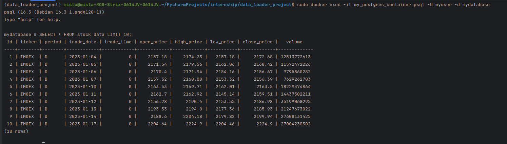

# Приложение для загрузки данных в PostgreSQL

## Описание

Приложение для загрузки данных из CSV файла в базу данных PostgreSQL. Данное приложение развёртывается в Docker-контейнерах и использует Python для обработки данных.

## Инструкции по установке

1. **Сборка и запуск контейнера PostgreSQL**:
   - Создание Dockerfile
   - Добавление в Dockerfile следующего содержимого:
     ```Dockerfile
     FROM postgres:latest
     ENV POSTGRES_DB mydatabase
     ENV POSTGRES_USER myuser
     ENV POSTGRES_PASSWORD mypassword
     EXPOSE 5432
     ```
   - Сборка Docker образа:
     ```sh
     sudo docker build -t my_postgres .
     ```
   - Запуск контейнера PostgreSQL:
     ```sh
     sudo docker run -d -p 5432:5432 --name my_postgres_container my_postgres
     ```

2. **Создание таблицы в PostgreSQL**:
   - Подключение к контейнеру PostgreSQL:
     ```sh
     sudo docker exec -it my_postgres_container psql -U myuser -d mydatabase
     ```
   - Выполнение SQL-запроса для создания таблицы:
     ```sql
     DROP TABLE IF EXISTS stock_data;

     CREATE TABLE stock_data (
         id SERIAL PRIMARY KEY,
         ticker VARCHAR(10),
         period VARCHAR(2),
         trade_date DATE,
         trade_time INTEGER,
         open_price NUMERIC,
         high_price NUMERIC,
         low_price NUMERIC,
         close_price NUMERIC,
         volume BIGINT
     );
     ```

3. **Сборка и запуск контейнера Python**:
   - Создание Dockerfile для Python
   - Добавление в Dockerfile.python следующего содержимого:
     ```Dockerfile
     FROM python:3.10.12
     WORKDIR /app
     COPY requirements.txt requirements.txt
     RUN pip install -r requirements.txt
     COPY . .
     CMD ["python", "data_loader.py"]
     ```
   - Создание файла requirements.txt:
     ```sh
     touch requirements.txt
     ```
   - Добавление в requirements.txt следующих зависимостей:
     ```plaintext
     requests
     psycopg2
     pandas
     ```
   - Сборка Docker образа для Python:
     ```sh
     sudo docker build -f Dockerfile.python -t my_python_app .
     ```
   - Запуск контейнера Python:
     ```sh
     sudo docker run -d --name my_python_app_container --link my_postgres_container:my_postgres_container my_python_app
     ```

   - Приложение загрузит данные из CSV файла и вставит их в базу данных PostgreSQL.


## Схема базы данных

```sql
DROP TABLE IF EXISTS stock_data;

CREATE TABLE stock_data (
    id SERIAL PRIMARY KEY,
    ticker VARCHAR(10),
    period VARCHAR(2),
    trade_date DATE,
    trade_time INTEGER,
    open_price NUMERIC,
    high_price NUMERIC,
    low_price NUMERIC,
    close_price NUMERIC,
    volume BIGINT
);
```

## Скриншот работы программы

